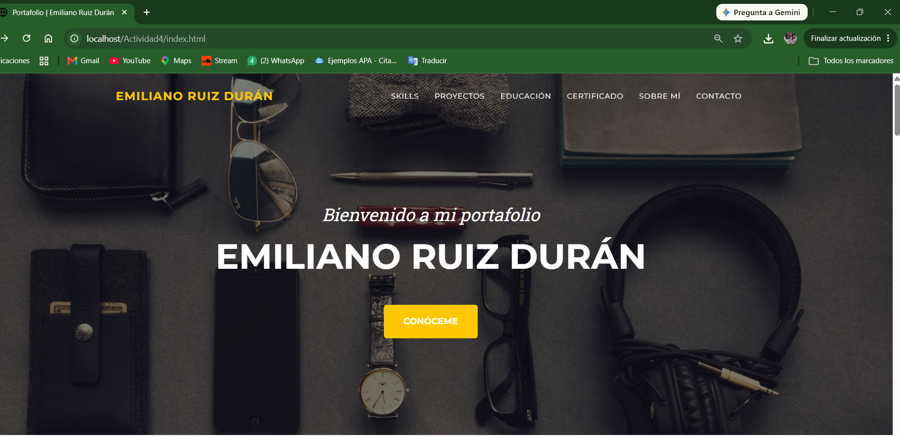
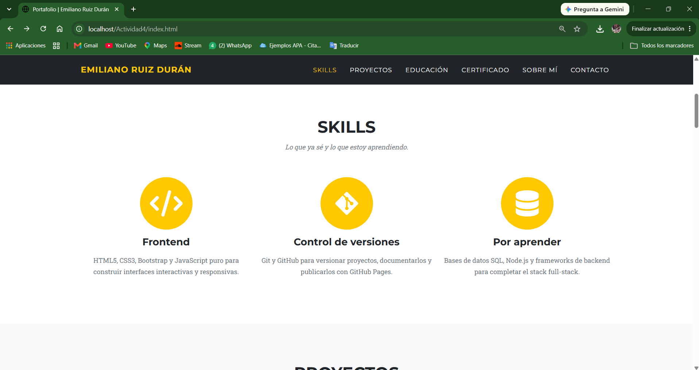
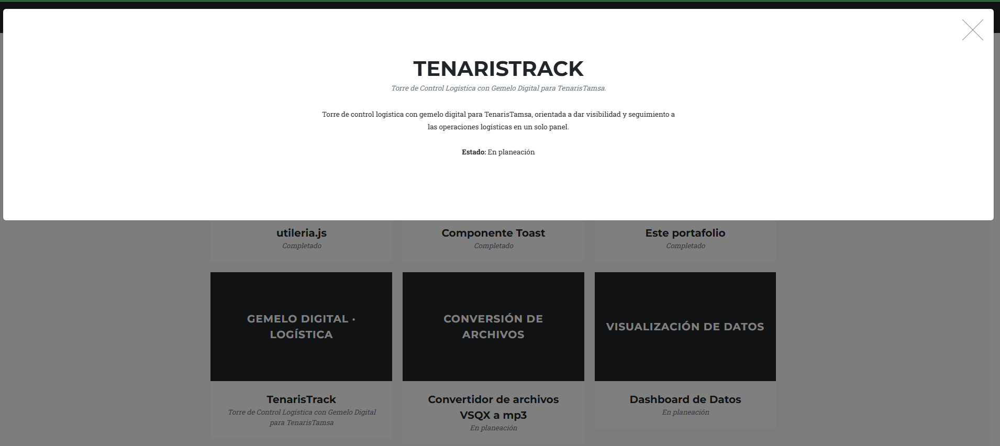
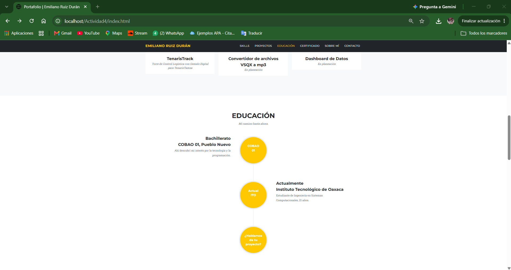
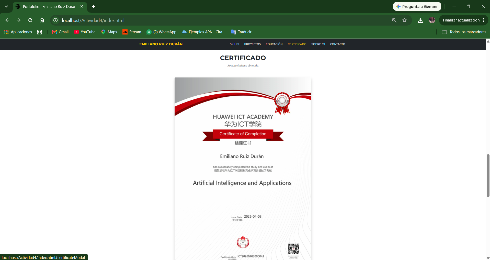
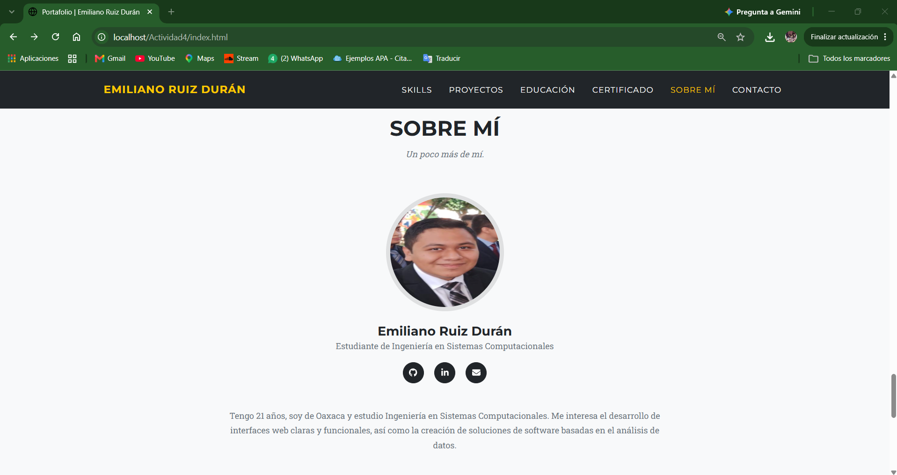
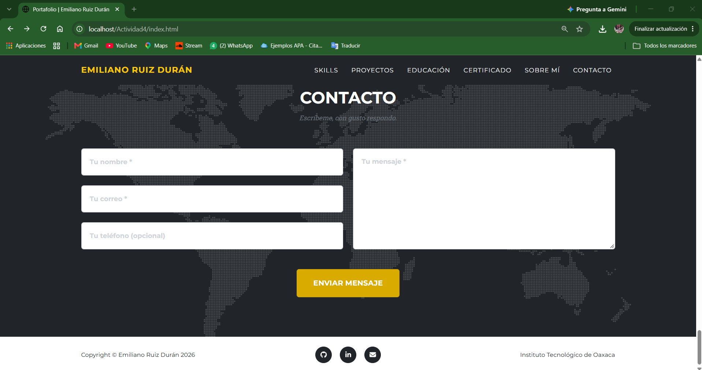

# Portafolio — Emiliano Ruiz Durán

## Portada

Portafolio personal de **Emiliano Ruiz Durán**, estudiante de Ingeniería en Sistemas Computacionales, construido sobre la plantilla Agency de Start Bootstrap conservando su diseño original.

🔗 **Repositorio:** _(pega aquí el link de tu repositorio de GitHub)_
🔗 **Demo en vivo (GitHub Pages):** _(pega aquí el link de tu GitHub Pages)_

---

## Descripción del proyecto

- **Framework CSS:** Bootstrap 5.2 (incluido dentro del CSS compilado de la plantilla), sin mezclar con Tailwind.
- **Plantilla base:** [Agency – Start Bootstrap](https://startbootstrap.com/theme/agency/) (licencia MIT).
- **Descarga de la plantilla:** https://startbootstrap.com/theme/agency/ · Código fuente: https://github.com/StartBootstrap/startbootstrap-agency · También instalable con `npm i startbootstrap-agency`.

| Sección (id) | Menú | Descripción |
|---|---|---|
| `header` | — | Portada con mensaje de bienvenida y mi nombre. |
| `#services` | Skills | Tres bloques con lo que ya sé (Frontend, Git/GitHub) y lo que estoy aprendiendo (bases de datos, backend). |
| `#portfolio` | Proyectos | Cuadrícula de 6 proyectos (3 reales: utileria.js, Componente Toast y este portafolio; 3 planeados: TenarisTrack — Torre de Control Logística con Gemelo Digital para TenarisTamsa, y Convertidor de archivos VSQX a mp3 y Dashboard de Datos), cada uno con un modal con más detalle. |
| `#about` | Educación | Línea de tiempo con mi bachillerato (COBAO 01, Pueblo Nuevo) y mis estudios actuales (Instituto Tecnológico de Oaxaca). |
| `#certificate` | Certificado | Imagen de mi certificado (`assets/img/certificado.png`), ampliable en un modal. |
| `#team` | Sobre mí | Mi foto, nombre, carrera y una breve descripción personal, con enlaces de contacto. |
| `#contact` | Contacto | Formulario con validación en JavaScript puro (sin depender de un servicio externo). |

---

## Proceso de creación

1. Descargué la plantilla oficial **Agency** de Start Bootstrap con `npm pack startbootstrap-agency` y tomé los archivos ya compilados de su carpeta `dist/`.
2. Usé como base el repositorio original de la plantilla (`startbootstrap-agency`, rama `gh-pages`) y dejé `css/styles.css` y `js/scripts.js` sin modificar.
3. Traduje todo el `index.html` al español y reemplacé el contenido de ejemplo por mi información real.
4. Renombré las secciones para que tuvieran sentido en un portafolio individual: "Services" → Skills, "About" (antes una línea de tiempo de una agencia) → Educación (mi propia línea de tiempo escolar), "Team" (antes 3 integrantes de un equipo) → Sobre mí, dejando solo mi propia tarjeta con mi foto real.
5. **Eliminé la sección "Clients"** (logos de Microsoft, Google, etc.) porque no aplicaba a un portafolio personal.
6. Las tarjetas de proyectos y la línea de tiempo de educación usan solo texto, sin imágenes.
7. **Quité la dependencia del formulario a "SB Forms"** (servicio externo de pago con token de API) y agregué `js/formulario.js`, una validación simple en JavaScript puro con mensaje de éxito o error local.
8. Agregué `css/extras.css` con un ajuste mínimo para las tarjetas de proyecto con texto, y la sección **Certificado**, que muestra la imagen `assets/img/certificado.png`.
9. Subí el proyecto a GitHub y activé GitHub Pages.

---

## Capturas de pantalla

### Inicio
Portada del portafolio con el mensaje de bienvenida, mi nombre y el menú de navegación.



### Skills
Sección donde se muestra las habilidades, con su respectivas descripciones.



### Proyectos
Cuadrícula de proyectos con el modal de TenarisTrack abierto, donde se muestra su descripción y estado.



### Educación
Línea de tiempo con mi bachillerato en COBAO 01 y mis estudios actuales en el Instituto Tecnológico de Oaxaca.



### Certificado
Sección donde se muestra mi certificado, que puede ampliarse al hacer clic sobre la imagen.



### Sobre mi
Información personal con foto personal y correo personal y github.



### Contacto
Formulario de contacto con validación en JavaScript y mensaje de confirmación al enviarse correctamente


---

## Estructura del repositorio

```
/Actividad4
├── README.md
├── index.html
├── css/
│   ├── styles.css      (original de la plantilla)
│   └── extras.css
├── js/
│   ├── scripts.js      (original de la plantilla)
│   └── formulario.js
└── assets/
    ├── favicon.ico
    └── img/
        ├── foto-perfil.jpeg
        ├── certificado.png
        ├── header-bg.jpg
        ├── map-image.png
        └── close-icon.svg
```

---

## Referencias

- Plantilla usada: [Agency – Start Bootstrap](https://startbootstrap.com/theme/agency/)
- Código fuente de la plantilla: [github.com/StartBootstrap/startbootstrap-agency](https://github.com/StartBootstrap/startbootstrap-agency)
- Paquete npm de la plantilla: [npmjs.com/package/startbootstrap-agency](https://www.npmjs.com/package/startbootstrap-agency)
- Framework CSS: [Bootstrap 5.2](https://getbootstrap.com/docs/5.2/)
- Iconos: [Font Awesome](https://fontawesome.com/)
- Tipografías: [Montserrat](https://fonts.google.com/specimen/Montserrat) y [Roboto Slab](https://fonts.google.com/specimen/Roboto+Slab), de Google Fonts

---

## 👤 Autor

Emiliano Ruiz Durán · 
